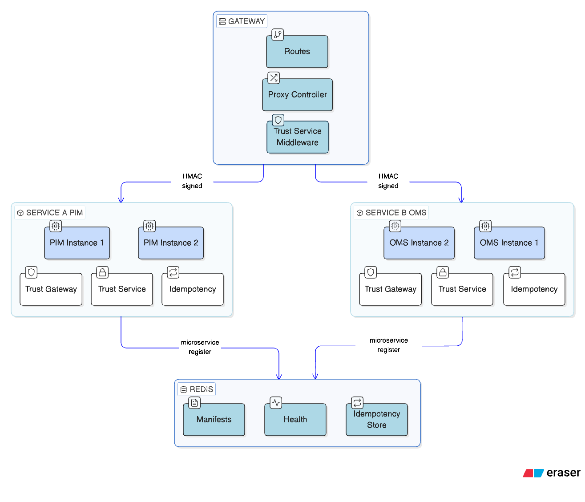

# Jurager/Microservice

[](https://packagist.org/packages/jurager/microservice)
[](https://packagist.org/packages/jurager/microservice)
[](https://packagist.org/packages/jurager/microservice)
[](https://packagist.org/packages/jurager/microservice)

Laravel package for inter-service communication in microservice architecture. Provides HTTP transport with failover, HMAC signing, route discovery via Redis, and idempotency.


- [Requirements](#requirements)
- [Installation](#installation)
- [Schema](#schema)
- [Configuration](#configuration)
  - [Service identity](#service-identity)
  - [Services registry](#services-registry)
  - [Defaults](#defaults)
- [Client](#client)
  - [Sending requests](#sending-requests)
  - [Request builder](#request-builder)
  - [ServiceResponse](#serviceresponse)
  - [Error handling](#error-handling)
  - [Failover and retry](#failover-and-retry)
- [Security](#security)
  - [HMAC signature](#hmac-signature)
  - [TrustGateway middleware](#trustgateway-middleware)
  - [TrustService middleware](#trustservice-middleware)
- [Idempotency](#idempotency)
- [Route Discovery](#route-discovery)
  - [Microservice setup](#microservice-setup)
  - [Receiving manifests (gateway)](#receiving-manifests-gateway)
  - [Gateway — registering routes](#gateway--registering-routes)
  - [Customizing gateway routes](#customizing-gateway-routes)
  - [ProxyController](#proxycontroller)
  - [Route caching](#route-caching)
  - [Manual route resolution](#manual-route-resolution)
  - [Permission checking (jurager/teams)](#permission-checking-juragerteams)
- [Health Tracking](#health-tracking)
- [Events](#events)
- [Artisan Commands](#artisan-commands)
- [Redis Keys](#redis-keys)
- [Testing](#testing)

## Requirements

- PHP >= 8.2 
- Laravel 11.x or higher
- Redis
- Guzzle 7+

## Installation

```bash
composer require jurager/microservice
```

Publish the configuration file:

```bash
php artisan vendor:publish --tag=microservice-config
```

## Schema



Each service can run **multiple instances** (`base_urls` in config). The client distributes requests across instances with automatic failover and health tracking.

**Flow:**

1. Each microservice registers its routes in Redis via `microservice:register`
2. The gateway reads manifests and creates Laravel routes via `Gateway::routes()`
3. Incoming requests are proxied to the target service by `ProxyController`
4. Services communicate directly via `ServiceClient` (HMAC-signed, verified by `TrustService`)
5. Unhealthy instances are excluded from rotation; the client fails over to the next available instance

## Configuration

`config/microservice.php`:

### Service identity

```php
'name'   => env('SERVICE_NAME', 'app'),       // unique service identifier
'secret' => env('SERVICE_SECRET', ''),         // shared HMAC secret (openssl rand -base64 32)

'algorithm'           => 'sha256',             // HMAC hash algorithm
'timestamp_tolerance' => 60,                   // max age of signed request in seconds
```

All services in the cluster **must use the same `secret`**.

### Services registry

```php
'services' => [
    'oms' => [
        'base_urls' => ['http://oms-1:8000', 'http://oms-2:8000'],
        'timeout'   => 5,     // optional, overrides defaults.timeout
        'retries'   => 2,     // optional, overrides defaults.retries
    ],
],
```

Multiple `base_urls` enable failover — the client tries each instance in order until one responds.

### Defaults

```php
'defaults' => [
    'timeout'     => 5,     // request timeout in seconds
    'retries'     => 2,     // retry attempts per instance
    'retry_delay' => 100,   // delay between retries in milliseconds
],

'redis' => [
    'connection' => env('SERVICE_REDIS_CONNECTION', 'default'),
    'prefix'     => 'microservice:',
],

'health' => [
    'failure_threshold' => 3,    // failures before marking instance unhealthy
    'recovery_timeout'  => 30,   // seconds before retrying unhealthy instance
],

'manifest' => [
    'ttl'     => 300,                                 // manifest TTL in Redis (seconds)
    'prefix'  => 'api',                               // only routes with this URI prefix are registered
    'gateway' => env('MANIFEST_GATEWAY_SERVICE'),     // gateway service name, or null for local Redis
],

'idempotency' => [
    'ttl'          => 60,   // cached response TTL in seconds
    'lock_timeout' => 10,   // distributed lock TTL in seconds
],
```

## Client

### Sending requests

```php
use Jurager\Microservice\Client\ServiceClient;

$client = app(ServiceClient::class);

// GET
$response = $client->service('oms')->get('/api/orders/123')->send();
$order = $response->json('data');

// POST with body and custom headers
$response = $client->service('oms')
    ->post('/api/orders', ['product_id' => 1, 'quantity' => 5])
    ->withHeaders(['X-Locale' => 'en'])
    ->timeout(10)
    ->send();

// PUT, PATCH, DELETE
$client->service('wms')->put('/api/stock/42', ['quantity' => 100])->send();
$client->service('wms')->patch('/api/stock/42', ['quantity' => 50])->send();
$client->service('oms')->delete('/api/orders/123')->send();
```

### Request builder

| Method | Description |
|---|---|
| `get(path)` | GET request |
| `post(path, body?)` | POST request with optional body |
| `put(path, body?)` | PUT request with optional body |
| `patch(path, body?)` | PATCH request with optional body |
| `delete(path)` | DELETE request |
| `withHeaders(array)` | Merge additional headers (e.g. `X-Locale`, `X-Request-Id`) |
| `withQuery(array)` | Merge query parameters |
| `withBody(array)` | Override request body |
| `timeout(seconds)` | Override timeout for this request |
| `retries(count)` | Override retry count for this request |
| `send()` | Execute and return `ServiceResponse` |

**Priority** for `timeout` / `retries`: explicit method call > per-service config > `defaults`.

### ServiceResponse

```php
$response->status();           // 200
$response->ok();               // true for 2xx
$response->failed();           // true for non-2xx
$response->json();             // full decoded body as array
$response->json('data.id');    // dot-notation access via data_get()
$response->json('key', 'def'); // with default value
$response->body();             // raw string
$response->header('X-Total');  // single header value or null
$response->headers();          // all headers as array
$response->throw();            // throws ServiceRequestException if failed, returns $this otherwise
$response->toPsrResponse();   // underlying PSR-7 ResponseInterface
```

### Error handling

```php
use Jurager\Microservice\Exceptions\ServiceUnavailableException;
use Jurager\Microservice\Exceptions\ServiceRequestException;

try {
    $response = $client->service('oms')->get('/api/orders/123')->send()->throw();
} catch (ServiceUnavailableException $e) {
    // All instances failed or no instances configured
    Log::error("Service unavailable: {$e->service}");
} catch (ServiceRequestException $e) {
    // Non-2xx response (thrown by ->throw())
    $status = $e->response->status();
    $body = $e->response->json();
}
```

| Exception | When |
|---|---|
| `ServiceUnavailableException` | All instances exhausted after retries, or service not configured |
| `ServiceRequestException` | Thrown by `->throw()` when response is non-2xx |

### Failover and retry

The client iterates through `base_urls` from the service config. For each instance it retries up to `retries` times with `retry_delay` between attempts.

- **5xx / connection errors** — retry, then failover to the next instance
- **4xx responses** — returned immediately, no retry
- If all healthy instances fail, the client falls back to the **full instance list** as a last resort
- If all instances are exhausted, `ServiceUnavailableException` is thrown

## Security

### HMAC signature

All outgoing requests via `ServiceClient` are signed automatically. Headers added to every request:

| Header | Description |
|---|---|
| `X-Signature` | HMAC signature |
| `X-Timestamp` | Unix timestamp |
| `X-Service-Name` | Sender service name (from `microservice.name`) |
| `X-Request-Id` | Unique request ID (auto-generated UUID, or custom via `withHeaders`) |
| `Content-Type` | `application/json` |

Signature payload:

```
payload   = "{METHOD}\n{PATH}\n{TIMESTAMP}\n{BODY}"
signature = hash_hmac('sha256', payload, SERVICE_SECRET)
```

Body is encoded with `JSON_UNESCAPED_UNICODE | JSON_UNESCAPED_SLASHES`, or empty string if absent. Verification uses timing-safe `hash_equals()`. Requests older than `timestamp_tolerance` seconds are rejected.

### TrustGateway middleware

Verifies HMAC signature on incoming requests. Apply to routes that receive requests from the gateway:

```php
use Jurager\Microservice\Http\Middleware\TrustGateway;

Route::middleware(TrustGateway::class)->group(function () {
    Route::apiResource('products', ProductController::class);
});
```

Required headers: `X-Signature`, `X-Timestamp`. Returns `401` if missing or invalid.

### TrustService middleware

Extends `TrustGateway` — additionally requires `X-Service-Name` header. Use for direct service-to-service routes:

```php
use Jurager\Microservice\Http\Middleware\TrustService;

Route::middleware(TrustService::class)->group(function () {
    Route::post('/internal/sync', [SyncController::class, 'handle']);
});
```

## Idempotency

The `Idempotency` middleware caches successful (2xx) responses by `X-Request-Id` header. Repeated requests with the same ID return the cached response without executing the handler.

```php
use Jurager\Microservice\Http\Middleware\Idempotency;

Route::middleware(Idempotency::class)->group(function () {
    Route::post('/api/orders', [OrderController::class, 'store']);
});
```

**Behavior:**

- Only non-safe methods (`POST`, `PUT`, `PATCH`, `DELETE`) with an `X-Request-Id` header are processed
- Safe methods (`GET`, `HEAD`, `OPTIONS`) and requests without `X-Request-Id` pass through
- `ServiceClient` generates `X-Request-Id` automatically on every outgoing request
- A distributed lock prevents concurrent processing of the same request — returns `409 Conflict`
- Only successful (2xx) responses are cached; failed responses are not
- Cached responses include the `X-Idempotency-Cache-Hit: true` header
- Response headers `date` and `set-cookie` are excluded from cache

Configuration: `microservice.idempotency.ttl` (cache TTL) and `microservice.idempotency.lock_timeout` (lock TTL).

## Route Discovery

Services register their routes in Redis for automatic gateway discovery. This eliminates route duplication — routes are defined once in the microservice and automatically appear on the gateway.

### Microservice setup

1. Configure the gateway as a service and set `manifest.gateway`:

```php
// config/microservice.php
'services' => [
    'gateway' => [
        'base_urls' => ['http://gateway:8000'],
    ],
],

'manifest' => [
    'gateway' => 'gateway',   // or env('MANIFEST_GATEWAY_SERVICE')
    'prefix'  => 'api',       // only routes starting with 'api' are registered
],
```

2. Attach metadata to routes (optional):

```php
$route = Route::get('/products', [ProductController::class, 'index'])
    ->name('products.index');

$route->setAction(array_merge($route->getAction(), [
    'permissions' => ['products.view'],
    'rate_limit'  => 60,
]));
```

Any keys not in the [excluded list](#excluded-action-keys) are forwarded to the gateway as route metadata.

3. Register on deploy and keep alive with the scheduler (manifest TTL = 300s by default):

```bash
php artisan microservice:register
```

```php
// bootstrap/app.php
->withSchedule(function (Schedule $schedule) {
    $schedule->command('microservice:register')->everyFiveMinutes();
})
```

When the service stops and stops re-registering, the manifest expires from Redis and the gateway stops routing to it.

#### Excluded action keys

The following Laravel internal keys are automatically excluded from manifest metadata:

`uses`, `controller`, `middleware`, `as`, `prefix`, `namespace`, `where`, `domain`, `excluded_middleware`, `withoutMiddleware`

### Receiving manifests (gateway)

The package auto-registers `POST /microservice/manifest`, protected by `TrustService` middleware. When a microservice runs `microservice:register` with `manifest.gateway` set, the manifest is pushed to this endpoint and stored in the gateway's Redis. No additional setup needed.

If `manifest.gateway` is `null`, the manifest is stored in local Redis (useful for single-node setups or testing).

### Gateway — registering routes

`Gateway::routes()` reads manifests from Redis and registers them as real Laravel routes. Each route is proxied to the corresponding service by `ProxyController`.

```php
// gateway/routes/api.php
use Jurager\Microservice\Gateway\Gateway;

Route::middleware(['auth:sanctum'])->group(function () {
    Gateway::routes();
});
```

All metadata from `setAction()` (permissions, rate_limit, etc.) is available on the gateway:

```php
$request->route()->getAction('permissions'); // ['products.view']
$request->route()->getAction('rate_limit');  // 60
$request->route()->getAction('_service');    // 'pim'
```

#### Filter by service

```php
Gateway::routes(services: ['pim', 'oms']);
```

#### Route prefixes

If services have overlapping URIs (e.g., both PIM and OMS expose `/api/products`), add a prefix per service:

```php
use Jurager\Microservice\Gateway\GatewayRoutes;

Gateway::routes(function (GatewayRoutes $routes) {
    $routes->service('pim')->prefix('catalog');
    $routes->service('oms')->prefix('orders');
});
```

By default, each service is prefixed with its name. Custom prefix overrides the default:

| Service | Manifest URI | Gateway URI |
|---|---|---|
| pim (default) | `/api/products` | `/pim/api/products` |
| pim (prefix: `catalog`) | `/api/products` | `/catalog/api/products` |
| oms (prefix: `orders`) | `/api/orders` | `/orders/api/orders` |

The `ProxyController` forwards the **original path** (without prefix) to the service.

### Customizing gateway routes

```php
use Jurager\Microservice\Gateway\GatewayRoutes;

Gateway::routes(function (GatewayRoutes $routes) {
    // Middleware for all routes of a service
    $routes->service('pim')->middleware(['analytics']);

    // Middleware for a specific route (ProxyController stays)
    $routes->service('oms')
        ->post('/api/orders')->middleware(['audit']);

    // Override controller for a specific route
    $routes->service('pim')
        ->get('/api/products/{product}', [ProductController::class, 'show']);

    // Override controller + middleware
    $routes->service('pim')
        ->post('/api/products/import', [ImportController::class, 'store'])
        ->middleware(['queue']);
});
```

All routes (including overridden) receive manifest metadata via `$request->route()->getAction()`.

### ProxyController

The default `ProxyController` proxies each request to the target service via `ServiceClient`:

- Forwards HTTP method, path, JSON body and query parameters
- Signs the request with HMAC automatically
- Sends `X-Forwarded-Host`, `X-Forwarded-Proto`, `X-Forwarded-Port` and `X-Forwarded-Prefix` headers to the backend
- Returns the service response with original status code and headers
- Filters out `Transfer-Encoding` and `Connection` headers
- Benefits from failover, retry and health tracking

To replace the default controller for all routes:

```php
Gateway::routes(controller: App\Http\Controllers\MyProxyController::class);
```

#### URL rewriting via TrustProxies

When the gateway proxies a request, `ProxyController` sends `X-Forwarded-*` headers to the backend service. The package automatically configures Laravel's `TrustProxies` middleware to trust the gateway hosts extracted from the `manifest.gateway` service's `base_urls`. No additional configuration is needed — if `manifest.gateway` is set, TrustProxies is configured automatically.

**Example:** gateway at `https://api.example.com` proxies to PIM at `http://pim:8000` with prefix `pim`:

| Header | Value |
|---|---|
| `X-Forwarded-Host` | `api.example.com` |
| `X-Forwarded-Proto` | `https` |
| `X-Forwarded-Prefix` | `/pim` |

With these headers, all URL generation on the backend (`url()`, `route()`, pagination links, etc.) will produce `https://api.example.com/pim/...` instead of `http://pim:8000/...`.

### Route caching

`Gateway::routes()` reads manifests from Redis on every request. For production, use Laravel's route cache:

```bash
php artisan route:cache
```

Routes are serialized to a file — no Redis calls at runtime. When a service pushes a new manifest via `POST /microservice/manifest`, the route cache is cleared automatically. Rebuild after all services have registered:

```bash
php artisan route:cache
```

### Manual route resolution

For cases where you don't use `Gateway::routes()`:

```php
use Jurager\Microservice\Registry\RouteRegistry;

$registry = app(RouteRegistry::class);

// Find which service handles a specific endpoint
$match = $registry->resolve('GET', '/api/products/123');
// ['service' => 'pim', 'method' => 'GET', 'uri' => '/api/products/{product}', 'permissions' => [...]]

// Get all registered routes across all services
$routes = $registry->getAllRoutes();
// [['service' => 'pim', 'method' => 'GET', 'uri' => '/api/products', 'name' => 'products.index'], ...]

// Get all manifests keyed by service name
$manifests = $registry->getAllManifests();
```

### Permission checking (jurager/teams)

Create a middleware on the gateway that reads `permissions` from route metadata:

```php
// gateway/app/Http/Middleware/CheckPermissions.php

class CheckPermissions
{
    public function handle(Request $request, Closure $next)
    {
        $permissions = $request->route()->getAction('permissions');

        if (!empty($permissions)) {
            $team = $request->user()->currentTeam;

            if (!$request->user()->hasTeamPermission($team, $permissions)) {
                abort(403);
            }
        }

        return $next($request);
    }
}
```

```php
// gateway/routes/api.php
Route::middleware(['auth:sanctum', CheckPermissions::class])->group(function () {
    Gateway::routes();
});
```

## Health Tracking

The `HealthRegistry` tracks instance failures in Redis. An instance is marked unhealthy after `failure_threshold` consecutive failures. After `recovery_timeout` seconds, the instance is given another chance.

| Action | Effect |
|---|---|
| `markFailure(service, url)` | Increments failure counter, stored with TTL = `recovery_timeout * 2` |
| `markSuccess(service, url)` | Deletes the health key entirely (full reset) |

Health is evaluated per-instance:
- **Below threshold** — instance is healthy, included in rotation
- **At/above threshold, within recovery timeout** — instance is excluded
- **At/above threshold, beyond recovery timeout** — instance gets another chance

```bash
php artisan service:health
```

```
+----------+--------------------+----------+---------------------+-----------+
| Service  | URL                | Failures | Last Failure        | Status    |
+----------+--------------------+----------+---------------------+-----------+
| oms      | http://oms-1:8000  | 0        | -                   | healthy   |
| oms      | http://oms-2:8000  | 5        | 2025-01-15 14:30:00 | unhealthy |
+----------+--------------------+----------+---------------------+-----------+
```

## Events

| Event | When | Properties |
|---|---|---|
| `ServiceRequestFailed` | Every failed attempt (5xx, connection error) before failover | `$service`, `$url`, `$method`, `$path`, `$statusCode`, `$message` |

```php
// app/Listeners/LogServiceFailure.php
use Jurager\Microservice\Events\ServiceRequestFailed;

class LogServiceFailure
{
    public function handle(ServiceRequestFailed $event): void
    {
        Log::warning("Service request failed", [
            'service' => $event->service,
            'url'     => $event->url,
            'method'  => $event->method,
            'path'    => $event->path,
            'status'  => $event->statusCode,
            'message' => $event->message,
        ]);
    }
}
```

Register in `EventServiceProvider` or use attribute-based discovery.

## Artisan Commands

| Command | Description |
|---|---|
| `microservice:register` | Build and register the service route manifest. Pushes to gateway if `manifest.gateway` is set, otherwise stores in local Redis. Displays registered routes in a table. |
| `service:health` | Display health status of all configured service instances with failure counts and status. |

## Redis Keys

All keys are prefixed with `microservice.redis.prefix` (default `microservice:`).

| Key Pattern | Purpose | TTL |
|---|---|---|
| `{prefix}health:{service}:{md5(url)}` | Instance failure counter and last failure timestamp | `recovery_timeout * 2` |
| `{prefix}manifest:{service}` | Service route manifest (JSON) | `manifest.ttl` (300s) |
| `{prefix}idempotency:{request_id}` | Cached response (status, headers, content) | `idempotency.ttl` (60s) |
| `{prefix}idempotency:{request_id}:lock` | Distributed processing lock | `idempotency.lock_timeout` (10s) |

## Testing

```bash
composer test
```

The package uses [Orchestra Testbench](https://github.com/orchestral/testbench) for testing. Redis interactions are mocked via Mockery — no running Redis instance required for tests.